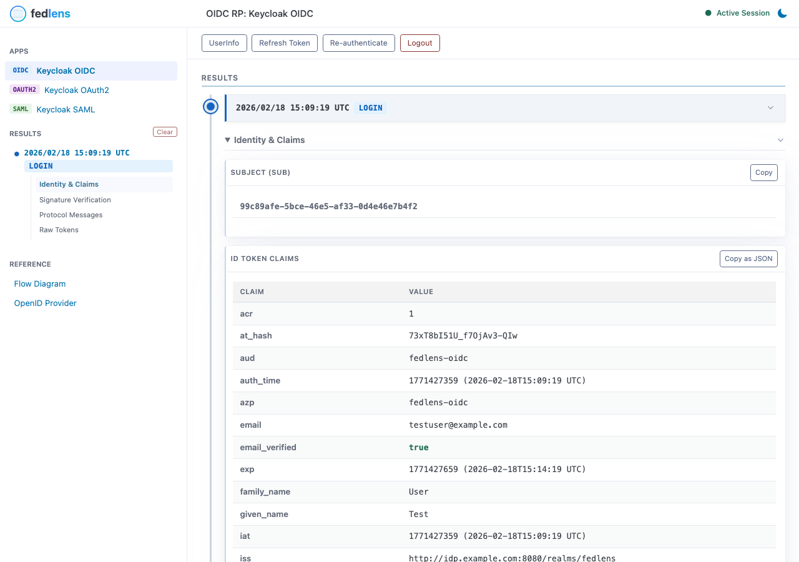
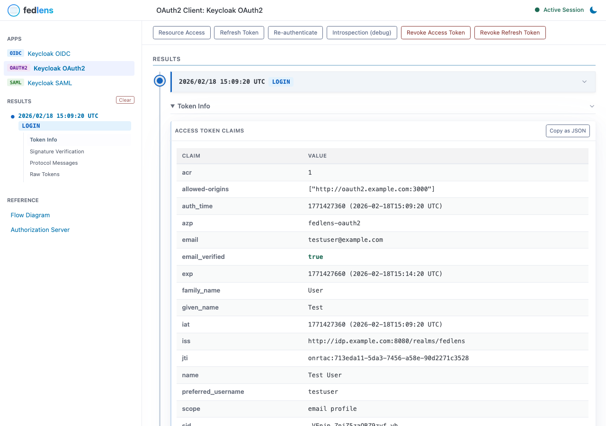
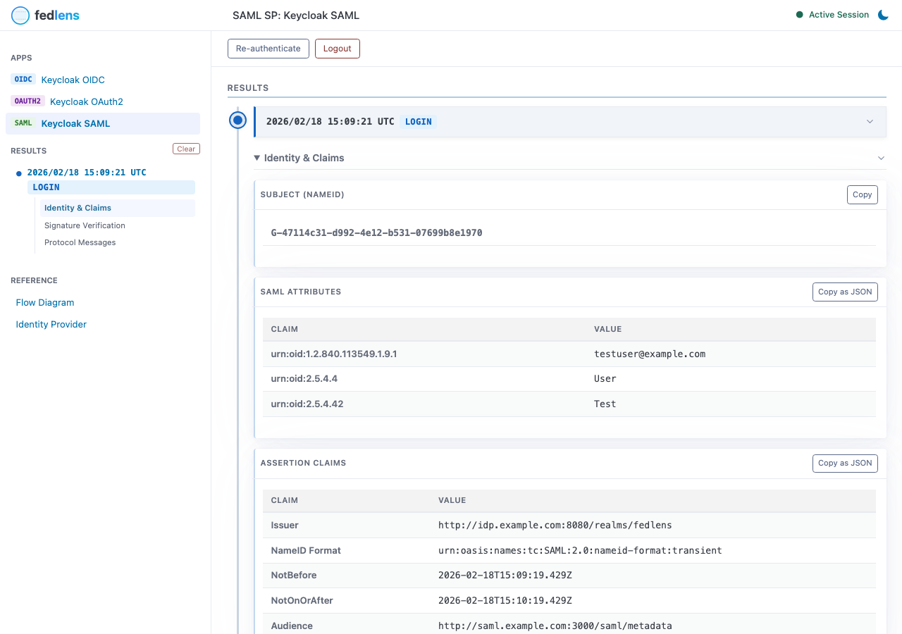

<p align="center">
  
</p>

<p align="center">
  A federation protocol debug tool for <strong>OIDC</strong> and <strong>SAML</strong>.<br>
  Also supports <strong>OAuth2</strong> as a closely related authorization framework.<br>
  fedlens acts as an <strong>OpenID Connect Relying Party</strong>, <strong>OAuth2 Client</strong>, <strong>OAuth2 Resource Server</strong>, and <strong>SAML Service Provider</strong>,<br>
  displaying raw protocol details at every step in a single web UI.
</p>

## Screenshots

**OIDC** — ID Token Claims and Signature Verification:



**OAuth2** — Access Token Claims and Token Introspection:



**SAML** — SAML Attributes and Signature Verification:



## Features

### OIDC (OpenID Connect)

- **Authorization Code Flow** with optional **PKCE** support (S256 / plain)
- **ID Token Claims** and **Access Token Claims** tables with timestamp formatting and boolean highlighting
- **UserInfo** endpoint response display
- **Signature Verification** for ID Token and Access Token (algorithm, key ID, JWKS key matching)
- **Token Refresh Flow** with refresh token rotation detection
- **Logout Flow** with configurable `id_token_hint`
- **Re-authentication Profiles** for step-up authentication with custom parameters
- **Custom Scopes**, **Response Mode**, and **Extra Auth Parameters**
- **Protocol Messages** — Authorization Request/Response, Token Request/Response, UserInfo Request/Response with full HTTP capture
- **Raw Tokens** — JWT structure display (Header / Payload / Signature) and opaque token display
- **Reference** — Authorization Code Flow sequence diagram, OpenID Provider endpoints, JWKS public keys, Discovery metadata
- **Results Timeline** — reverse-chronological log of all protocol interactions

### OAuth2

OAuth2 is an authorization framework, not a federation protocol. fedlens includes OAuth2 support to debug Authorization Server interactions — token issuance, introspection, revocation, and resource access — alongside OIDC and SAML flows.

- **Authorization Code Flow** with optional **PKCE** support (S256 / plain)
- **RFC 8414 Discovery** (Authorization Server Metadata) or manual endpoint configuration
- **Access Token Claims** table (when JWT) with boolean highlighting, opaque token detection with introspection guidance
- **Signature Verification** for Access Token (algorithm, key ID, JWKS key matching)
- **Token Refresh Flow** with refresh token rotation detection
- **Token Introspection** (RFC 7662) with HTTP request/response capture
- **Token Revocation** (RFC 7009) for Access Token and Refresh Token independently
- **Resource Access** — built-in Resource Server with separate RS credentials, custom resource URL testing, RFC 9728 Protected Resource Metadata
- **Re-authentication Profiles** for custom authorization parameters
- **Protocol Messages** — Authorization Request/Response, Token Request/Response, Introspection/Revocation Request/Response, Resource Request/Response with full HTTP capture
- **Raw Tokens** — JWT structure display (Header / Payload / Signature) and opaque token display
- **Reference** — Authorization Code Flow and Protected Resource Access sequence diagrams, AS endpoints, JWKS public keys, AS metadata
- **Results Timeline** — reverse-chronological log of all protocol interactions

### SAML

- **SP-Initiated SSO** with HTTP-Redirect and HTTP-POST bindings
- **IdP-Initiated SSO** support (configurable)
- **Identity & Claims** — Subject (NameID), SAML Attributes, and Assertion Claims (Issuer, Audience, AuthnContextClassRef, validity period)
- **Signature Verification** at both Response and Assertion levels
- **Single Logout (SLO)** — SP-initiated and IdP-initiated with redirect/POST binding support
- **Re-authentication Profiles** with `ForceAuthn` and custom `AuthnContextClassRef`
- **External Certificate** support (load from file) or auto-generated self-signed cert
- **Protocol Messages** — AuthnRequest (URL parameters + decoded XML), SAML Response (POST parameters + decoded XML), LogoutRequest/LogoutResponse with binding details
- **Reference** — SP-Initiated SSO and IdP-Initiated SSO sequence diagrams, IdP endpoints, IdP certificates with PEM, IdP Metadata XML
- **Results Timeline** — reverse-chronological log of all protocol interactions

### General

- **Multiple SP/RP** support via TOML configuration with **Tab Navigation**
- **Host-based and Path-based Routing** — multiple instances on same or different hosts
- **TLS Support** with self-signed cert auto-generation or external certificates
- **Dark Mode** toggle with system preference detection (`light` / `dark` / `auto`)
- **Timezone Configuration** for timestamp display (IANA format)
- **Boolean Value Highlighting** in claims tables (true=green, false=red)
- **Syntax Highlighting** for JSON and XML (Prism.js)
- **Copy Buttons** on all code blocks
- **Collapsible Sections** with state persistence
- Single binary, Docker-ready
- Structured logging (`log/slog`) with configurable log level
- Graceful shutdown (SIGINT / SIGTERM)

## Quick Start

### Docker Compose (with Keycloak)

The easiest way to try fedlens is using Docker Compose with a pre-configured Keycloak instance.

**Prerequisites:**

Add the following entries to your `/etc/hosts`:

```
127.0.0.1 idp.example.com oidc.example.com saml.example.com oauth2.example.com
```

**Start:**

```bash
docker compose up
```

**Access:**

- OIDC view: http://oidc.example.com:3000
- OAuth2 view: http://oauth2.example.com:3000
- SAML view: http://saml.example.com:3000
- Keycloak Admin Console: http://idp.example.com:8080 (admin / admin)

**Test user:** `testuser` / `password`

### Build from Source

```bash
make build
```

This runs `templ generate` and then builds the Go binary. The output is a single `fedlens` binary with all static assets embedded.

## Configuration

Set the `CONFIG_FILE` environment variable to point to your TOML file:

```bash
CONFIG_FILE=config.toml ./fedlens
```

See [config.example.toml](config.example.toml) for a full example.

#### Global Settings

| Key | Default | Description |
|---|---|---|
| `listen_addr` | `:3000` | Listen address |
| `insecure_skip_verify` | `false` | Skip TLS certificate verification |
| `log_level` | `info` | Log level (`debug`, `info`, `warn`, `error`) |
| `theme` | `auto` | UI theme (`light`, `dark`, `auto`) |
| `timezone` | `UTC` | IANA timezone for timestamp display (e.g. `Asia/Tokyo`) |
| `tls_cert_path` | | Path to TLS certificate PEM file |
| `tls_key_path` | | Path to TLS private key PEM file |
| `tls_self_signed` | `false` | Auto-generate self-signed TLS certificate |

#### OIDC RP (`[[oidc]]`)

Each `[[oidc]]` block defines a separate OIDC Relying Party.

| Key | Required | Default | Description |
|---|---|---|---|
| `name` | Yes | | Display name (shown in tab) |
| `base_url` | Yes | | Base URL for routing (e.g. `http://oidc.example.com:3000` or `http://localhost:3000/myapp`) |
| `issuer` | Yes | | OIDC Issuer URL |
| `client_id` | Yes | | Client ID |
| `client_secret` | Yes | | Client Secret |
| `redirect_uri` | Yes | | Redirect URI (callback URL) |
| `scopes` | No | `["openid", "profile", "email"]` | Requested scopes |
| `pkce` | No | `false` | Enable PKCE |
| `pkce_method` | No | `S256` | PKCE method (`S256` or `plain`) |
| `response_type` | No | `code` | Response type |
| `response_mode` | No | (default) | Response mode (`query`, `fragment`, `form_post`) |
| `callback_path` | No | `/callback` | Callback endpoint path (for mocking SaaS RP) |
| `extra_auth_params` | No | | Extra auth parameters (e.g. `{ prompt = "consent" }`) |
| `logout_id_token_hint` | No | `true` | Send `id_token_hint` in logout request |

##### OIDC Re-authentication Profiles (`[[oidc.reauth]]`)

Each `[[oidc.reauth]]` block defines a re-authentication profile with custom parameters.

| Key | Required | Description |
|---|---|---|
| `name` | Yes | Display name for the reauth button |
| `extra_auth_params` | Yes | Extra auth parameters for re-authentication |

```toml
[[oidc.reauth]]
name = "Step-up Auth"
extra_auth_params = { acr_values = "urn:example:mfa" }
```

#### OAuth2 Client (`[[oauth2]]`)

Each `[[oauth2]]` block defines a separate OAuth2 Client. Unlike OIDC, there is no ID Token or UserInfo — the focus is on Access Token issuance and AS interactions.

| Key | Required | Default | Description |
|---|---|---|---|
| `name` | Yes | | Display name (shown in tab) |
| `base_url` | Yes | | Base URL for routing |
| `issuer` | No* | | RFC 8414 Discovery URL |
| `authorization_url` | No* | | Authorization endpoint URL (manual) |
| `token_url` | No* | | Token endpoint URL (manual) |
| `introspection_url` | No | | Token Introspection endpoint URL |
| `revocation_url` | No | | Token Revocation endpoint URL |
| `client_id` | Yes | | Client ID |
| `client_secret` | Yes | | Client Secret |
| `redirect_uri` | Yes | | Redirect URI (callback URL) |
| `scopes` | No | `["profile", "email"]` | Requested scopes |
| `pkce` | No | `false` | Enable PKCE |
| `pkce_method` | No | `S256` | PKCE method (`S256` or `plain`) |
| `response_mode` | No | (default) | Response mode (`query`, `fragment`, `form_post`) |
| `callback_path` | No | `/callback` | Callback endpoint path |
| `extra_auth_params` | No | | Extra auth parameters |
| `resource_urls` | No | | Custom Resource Server URLs to test (e.g. `["https://api.example.com/me"]`) |
| `resource_server_client_id` | No | | Client ID for built-in Resource Server (Token Introspection) |
| `resource_server_client_secret` | No | | Client Secret for built-in Resource Server (Token Introspection) |

\* Either `issuer` (for RFC 8414 Discovery) or both `authorization_url` + `token_url` (manual) are required.

##### OAuth2 Re-authentication Profiles (`[[oauth2.reauth]]`)

Same format as OIDC re-authentication profiles.

#### SAML SP (`[[saml]]`)

Each `[[saml]]` block defines a separate SAML Service Provider.

| Key | Required | Default | Description |
|---|---|---|---|
| `name` | Yes | | Display name (shown in tab) |
| `base_url` | Yes | | Base URL for routing (e.g. `http://saml.example.com:3000` or `http://localhost:3000/myapp`) |
| `idp_metadata_url` | Yes | | IdP Metadata URL |
| `entity_id` | Yes | | SP Entity ID |
| `root_url` | Yes | | SP Root URL |
| `acs_path` | No | `/saml/acs` | Assertion Consumer Service path (for mocking SaaS SP) |
| `slo_path` | No | `/saml/slo` | Single Logout endpoint path |
| `metadata_path` | No | `/saml/metadata` | SP Metadata endpoint path |
| `cert_path` | No | (auto-generated) | Path to SP certificate PEM file |
| `key_path` | No | (auto-generated) | Path to SP private key PEM file |
| `allow_idp_initiated` | No | `false` | Allow IdP-Initiated SSO (skips InResponseTo validation) |

##### SAML Re-authentication Profiles (`[[saml.reauth]]`)

Each `[[saml.reauth]]` block defines a re-authentication profile.

| Key | Required | Default | Description |
|---|---|---|---|
| `name` | Yes | | Display name for the reauth button |
| `authn_context_class_ref` | No | | SAML AuthnContextClassRef |
| `force_authn` | No | `false` | Force re-authentication |

```toml
[[saml.reauth]]
name = "MFA"
authn_context_class_ref = "urn:oasis:names:tc:SAML:2.0:ac:classes:PasswordProtectedTransport"
force_authn = true
```

#### Example: Multiple SP/RP

```toml
listen_addr = ":3000"
log_level = "debug"
# theme = "dark"
# timezone = "Asia/Tokyo"
# tls_self_signed = true

[[oidc]]
name = "Keycloak OIDC"
base_url = "http://kc-oidc.example.com:3000"
issuer = "https://keycloak.example.com/realms/test"
client_id = "fedlens"
client_secret = "secret"
redirect_uri = "http://kc-oidc.example.com:3000/callback"
pkce = true

[[oidc]]
name = "Entra ID"
base_url = "http://entra-oidc.example.com:3000"
issuer = "https://login.microsoftonline.com/xxx/v2.0"
client_id = "yyy"
client_secret = "zzz"
redirect_uri = "http://entra-oidc.example.com:3000/callback"
extra_auth_params = { login_hint = "user@example.com" }

[[saml]]
name = "Keycloak SAML"
base_url = "http://kc-saml.example.com:3000"
idp_metadata_url = "https://keycloak.example.com/realms/test/protocol/saml/descriptor"
entity_id = "http://kc-saml.example.com:3000/saml/metadata"
root_url = "http://kc-saml.example.com:3000"

[[saml]]
name = "Okta SAML"
base_url = "http://okta-saml.example.com:3000"
idp_metadata_url = "https://okta.example.com/app/xxx/sso/saml/metadata"
entity_id = "http://okta-saml.example.com:3000/saml/metadata"
root_url = "http://okta-saml.example.com:3000"

[[oauth2]]
name = "GitHub OAuth"
base_url = "http://github-oauth.example.com:3000"
authorization_url = "https://github.com/login/oauth/authorize"
token_url = "https://github.com/login/oauth/access_token"
client_id = "your-github-client-id"
client_secret = "your-github-client-secret"
redirect_uri = "http://github-oauth.example.com:3000/callback"
scopes = ["read:user", "user:email"]
```

This produces tabs: `Keycloak OIDC` | `Entra ID` | `GitHub OAuth` | `Keycloak SAML` | `Okta SAML`

## How It Works

fedlens runs a single HTTP server that routes requests based on `base_url` (host + optional path prefix):

- Each `[[oidc]]` entry creates an OIDC RP handler bound to its `base_url`
- Each `[[oauth2]]` entry creates an OAuth2 Client handler bound to its `base_url`
- Each `[[saml]]` entry creates a SAML SP handler bound to its `base_url`
- **Host-based**: `base_url = "http://oidc.example.com:3000"` → routes by host only
- **Path-based**: `base_url = "http://localhost:3000/myapp"` → routes by host + path prefix (no `/etc/hosts` needed)

On startup, fedlens fetches OIDC discovery metadata, OAuth2 authorization server metadata (RFC 8414), and SAML IdP metadata, making them available on the pre-login screen. After authentication, all protocol exchange details (tokens, assertions, signatures) are displayed.

### `base_url` and TLS Deployment Patterns

The `base_url` field specifies the **externally visible URL** (scheme + host + optional path). The scheme in `base_url` does not affect how fedlens listens — it is used for routing, navigation links, and cookie scoping.

#### Pattern 1: Plain HTTP (development)

```toml
listen_addr = ":3000"

[[oidc]]
base_url = "http://localhost:3000/keycloak"
```

#### Pattern 2: TLS terminated by fedlens

```toml
listen_addr = ":443"
tls_self_signed = true    # or tls_cert_path / tls_key_path

[[oidc]]
base_url = "https://oidc.example.com"
```

#### Pattern 3: TLS terminated by reverse proxy (nginx, etc.)

The reverse proxy handles TLS and forwards plain HTTP to fedlens. Set `base_url` to the **external** `https://` URL. Ensure the proxy sets `X-Forwarded-Proto: https` so that fedlens correctly sets the `Secure` flag on cookies.

```toml
listen_addr = ":3000"    # fedlens listens on plain HTTP

[[oidc]]
base_url = "https://oidc.example.com"    # external URL seen by browsers
```

```nginx
server {
    listen 443 ssl;
    server_name oidc.example.com;

    proxy_set_header Host $host;
    proxy_set_header X-Forwarded-Proto https;

    location / {
        proxy_pass http://fedlens:3000;
    }
}
```

## Development

```bash
# Build (generate templ + compile)
make build

# Development mode (generate + run)
make dev

# Run unit tests
make test

# Run E2E tests (requires Docker)
make e2e

# Clean build artifacts
make clean
```

### E2E Tests

E2E tests use [Playwright](https://playwright.dev/) and run against Chromium, Firefox, and WebKit.

```bash
# Setup (first time)
cd e2e && npm install && npx playwright install && cd ..

# Run all E2E tests
make e2e
```

#### Playwright Selectors

The HTML is designed for easy E2E testing. Use the `id` attributes to scope into a specific result entry or section, then use `getByTestId()` to select value cells.

**Scoping by `id`**

| Selector | Scope |
|---|---|
| `#result-0` | First (most recent) result entry |
| `#result-0-claims` | Identity & Claims section (contains sub-tables below) |
| `#result-0-id-token-claims` | ID Token Claims table (OIDC) |
| `#result-0-access-token-claims` | Access Token Claims table (OIDC) |
| `#result-0-userinfo-claims` | UserInfo Claims table (OIDC) |
| `#result-0-attributes` | SAML Attributes table |
| `#result-0-sigs` | Signature Verification section |
| `#result-0-response` | SAML Response Details section |
| `#result-0-protocol` | Protocol Messages section |
| `#result-0-tokens` | Raw Tokens section (OIDC) |
| `#result-0-error` | Error Details section |

**`data-testid` on action buttons**

The action bar buttons have fixed `data-testid` attributes. Visibility depends on session state.

| `data-testid` | Element | Protocol | Shown when |
|---|---|---|---|
| `login-btn` | Login button | OIDC / OAuth2 / SAML | No session |
| `logout-btn` | Logout button | OIDC / OAuth2 / SAML | Active session |
| `userinfo-btn` | UserInfo button | OIDC only | Active session + UserInfo endpoint configured |
| `introspection-btn` | Introspection button | OIDC / OAuth2 | Active session + Introspection endpoint configured |
| `revoke-at-btn` | Revoke Access Token button | OIDC / OAuth2 | Active session + Revocation endpoint configured |
| `revoke-rt-btn` | Revoke Refresh Token button | OIDC / OAuth2 | Active session + Revocation endpoint + refresh token present |
| `resource-access-btn` | Resource Access button | OAuth2 | Resource Server configured (built-in RS requires `resource_server_client_id`) |
| `refresh-btn` | Refresh Token button | OIDC / OAuth2 | Active session + refresh token present |
| `reauth-btn` | Re-authenticate (default) | OIDC / OAuth2 / SAML | Active session + `[[*.reauth]]` configured |
| `reauth-more-btn` | "More ▾" dropdown trigger | OIDC / OAuth2 / SAML | 2+ reauth profiles configured |
| `reauth-0`, `reauth-1`, ... | Dropdown reauth items (0-indexed) | OIDC / OAuth2 / SAML | Inside "More ▾" dropdown |

**`data-testid` on value cells**

All value `<td>` elements have `data-testid` attributes for direct access:

| Category | Naming Convention | Examples |
|---|---|---|
| Claims / Attributes | IdP key as-is | `sub`, `email`, `preferred_username`, `urn:oid:1.2.840.113549.1.9.1` |
| Subject | Fixed | `subject` |
| Error (OIDC) | OAuth 2.0 parameter names | `error`, `error_description`, `error_uri`, `detail` |
| Error (SAML) | snake_case | `status_code`, `detail` |
| Signature | Label → `toTestID()` | `verified`, `algorithm`, `key_id_kid`, `key_type_kty` |
| Response Details | Label → `toTestID()` | `issuer`, `status_code`, `destination` |
| Params | Parameter key as-is | `redirect_uri`, `scope`, `response_type` |

The `toTestID()` conversion rule for Signature / Response Details labels:
1. Remove parentheses → `Key ID (kid)` → `Key ID kid`
2. Lowercase → `key id kid`
3. Replace spaces with `_` → `key_id_kid`

**Example: Action button interactions**

```typescript
// Pre-login: click Login
await page.getByTestId('login-btn').click();

// Post-login: trigger actions
await page.getByTestId('userinfo-btn').click();       // OIDC only
await page.getByTestId('refresh-btn').click();         // OIDC only
await page.getByTestId('reauth-btn').click();          // Re-authenticate (default profile)
await page.getByTestId('reauth-more-btn').click();     // Open dropdown
await page.getByTestId('reauth-0').click();            // Select first additional profile
await page.getByTestId('logout-btn').click();
```

**Example: OIDC login assertions**

```typescript
// Subject is unique within #result-0-claims
const claims = page.locator('#result-0-claims');
await expect(claims.getByTestId('subject')).not.toBeEmpty();

// Scope to specific token table to avoid ambiguity (same claim may exist in ID Token, Access Token, UserInfo)
const idTokenClaims = page.locator('#result-0-id-token-claims');
await expect(idTokenClaims.getByTestId('preferred_username')).toHaveText('testuser');
await expect(idTokenClaims.getByTestId('email')).toHaveText('testuser@example.com');

const sigs = page.locator('#result-0-sigs');
await expect(sigs.getByTestId('verified')).toHaveText('true');
```

**Example: SAML login assertions**

```typescript
const claims = page.locator('#result-0-claims');
await expect(claims.getByTestId('subject')).not.toBeEmpty();

const attributes = page.locator('#result-0-attributes');
await expect(attributes.getByTestId('urn:oid:1.2.840.113549.1.9.1')).toHaveText('testuser@example.com');

const sigs = page.locator('#result-0-sigs');
await expect(sigs.getByTestId('verified')).toHaveText('true');
```

**Example: Error assertions**

```typescript
// OIDC
const oidcError = page.locator('#result-0-error');
await expect(oidcError.getByTestId('error')).toHaveText('invalid_grant');
await expect(oidcError.getByTestId('error_description')).toContainText('expired');

// SAML
const samlError = page.locator('#result-0-error');
await expect(samlError.getByTestId('status_code')).toHaveText('saml_validation_failed');
await expect(samlError.getByTestId('detail')).toContainText('InResponseTo');
```

### Tech Stack

| Component | Technology |
|---|---|
| Language | Go 1.26+ |
| Templates | [templ](https://templ.guide/) (compiled to Go) |
| Dynamic UI | [htmx](https://htmx.org/) 2.0.7 |
| CSS | [Pico CSS](https://picocss.com/) 2.1.1 |
| Syntax Highlighting | [Prism.js](https://prismjs.com/) 1.30.0 |
| Configuration | [TOML](https://toml.io/) (BurntSushi/toml) |
| OIDC | coreos/go-oidc + golang.org/x/oauth2 |
| SAML | crewjam/saml |

## License

Apache License 2.0
